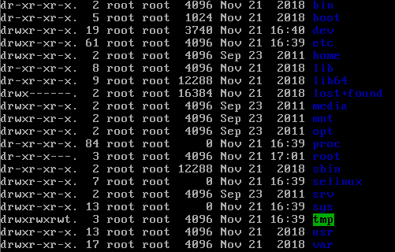

# Linux目录目录结构

* bin(binaries) 存放二进制可执行文件
* sbin(super user binaries) 只有root才能访问
* etc(etcetera) 存放系统配置文件
* usr(unix shared resources) 用于存放共享的系统资源
* home 存放用户文件的根目录
* root 超级用户目录
* dev(devices) 用于存放设备文件
* lib(library) 存放系统文件中程序运行所需共享库以及内核模块
* mnt(mount) 系统管理员安装临时文件系统的安装点
* boot 存放系统启动时引导的文件
* tmp 存放临时文件 所有人可以访问
* var(variable) 存放运行时需要改变数据的文件

[文件目录的详细介绍](https://www.cnblogs.com/silence-hust/p/4319415.html)

# 常用命令

## 切换目录

* 使用`cd`命令
	* `cd <name>` 切换到目录
	* `cd ..` 切换到上级目录
	* `cd /` 切换到系统根目录
	* `cd ~` 切换到用户主目录
	* `cd -` 切换到上一个目录