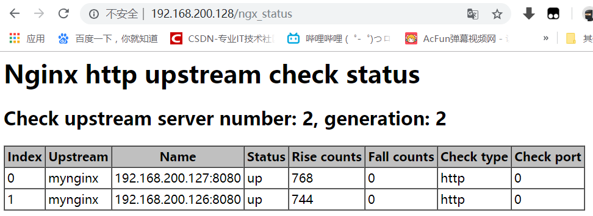

# Nginx基础

## 简介

·  Nginx ("engine x") 是一个高性能的 HTTP 和 反向代理 服务器，也是一 IMAP/POP3/SMTP 代理服务器。
·  第一个公开版本0.1.0发布于2004年10月4日。
·  其将源代码以类BSD许可证的形式发布，因它的稳定性、丰富的功能集、示例配置文件和低系统资源的消耗而闻名
·  官方测试nginx能够支支撑5万并发链接，并且cpu、内存等资源消耗却非常低，运行非常稳定

## Tengine

nginx加强版,阿里开源,兼容nginx,修复bug,功能更强,性能更好

## 需要解决的问题

高并发,均衡负载
高可用
session一致性(redis)

## Tengin编译安装

上传并解压tengin包

安装依赖

`yum -y install gcc openssl-devel pcre-devel zlib-devel`

编译安装

在tenginx目录中执行命令

```linux
  ./configure \
  --prefix=**/home/apps/**tengine-2.1.0/ \     //星号括起来的为要安装的目录
  --error-log-path=/var/log/nginx/error.log \
  --http-log-path=/var/log/nginx/access.log \
  --pid-path=/var/run/nginx/nginx.pid  \
  --lock-path=/var/lock/nginx.lock \
  --with-http_ssl_module \
  --with-http_flv_module \
  --with-http_stub_status_module \
  --with-http_gzip_static_module \
  --http-client-body-temp-path=/var/tmp/nginx/client/ \
  --http-proxy-temp-path=/var/tmp/nginx/proxy/ \
  --http-fastcgi-temp-path=/var/tmp/nginx/fcgi/ \
  --http-uwsgi-temp-path=/var/tmp/nginx/uwsgi \
  --http-scgi-temp-path=/var/tmp/nginx/scgi \
  --with-pcre
```

执行安装命令

`make && make install`

## 准备启动文件

在/etc/init.d目录下,创建一个启动文件名为nginx

```sh
#!/bin/bash
#
# chkconfig: - 85 15
# description: nginx is a World Wide Web server. It is used to serve
# Source function library.
. /etc/rc.d/init.d/functions

# Source networking configuration.
. /etc/sysconfig/network

# Check that networking is up.
[ "$NETWORKING" = "no" ] && exit 0

#改为自己安装目录路径
nginx="/home/apps/tengine-2.1.0/sbin/nginx"
prog=$(basename $nginx)

#改为自己安装目录路径
NGINX_CONF_FILE="/home/apps/tengine-2.1.0/conf/nginx.conf"

#[ -f /etc/sysconfig/nginx ] && . /etc/sysconfig/nginx

lockfile=/var/lock/subsys/nginx

#make_dirs() {
#   # make required directories
#   user=`nginx -V 2>&1 | grep "configure arguments:" | sed 's/[^*]*--user=\([^ ]*\).*/\1/g' -`
#   options=`$nginx -V 2>&1 | grep 'configure arguments:'`
#   for opt in $options; do
#       if [ `echo $opt | grep '.*-temp-path'` ]; then
#           value=`echo $opt | cut -d "=" -f 2`
#           if [ ! -d "$value" ]; then
#               # echo "creating" $value
#               mkdir -p $value && chown -R $user $value
#           fi
#       fi
#   done
#}

start() {
    [ -x $nginx ] || exit 5
    [ -f $NGINX_CONF_FILE ] || exit 6
#    make_dirs
    echo -n $"Starting $prog: "
    daemon $nginx -c $NGINX_CONF_FILE
    retval=$?
    echo
    [ $retval -eq 0 ] && touch $lockfile
    return $retval
}

stop() {
    echo -n $"Stopping $prog: "
    killproc $prog -QUIT
    retval=$?
    echo
    [ $retval -eq 0 ] && rm -f $lockfile
    return $retval
}

restart() {
    configtest || return $?
    stop
    sleep 1
    start
}

reload() {
    configtest || return $?
    echo -n $"Reloading $prog: "
#  -HUP是nginx平滑重启参数
    killproc $nginx -HUP
    RETVAL=$?
    echo
}

force_reload() {
    restart
}

configtest() {
  $nginx -t -c $NGINX_CONF_FILE
}

rh_status() {
    status $prog
}

rh_status_q() {
    rh_status >/dev/null 2>&1
}

case "$1" in
    start)
        rh_status_q && exit 0
        $1
        ;;
    stop)
        rh_status_q || exit 0
        $1
        ;;
    restart|configtest)
        $1
        ;;
    reload)
        rh_status_q || exit 7
        $1
        ;;
    force-reload)
        force_reload
        ;;
    status)
        rh_status
        ;;
    condrestart|try-restart)
        rh_status_q || exit 0
            ;;
    *)
        echo $"Usage: $0 {start|stop|status|restart|condrestart|try-restart|reload|force-reload|configtest}"
        exit 2
esac
```

保存后给脚本可执行权限
`chmod 755 nginx`

## 测试启动nginx

创建工作目录

`mkdir -p /var/tmp/nginx/client/`

启动nginx

`service nginx start`

测试nginx

浏览器中输入nginx服务器地址,显示如下页面表示成功


## 将tengine加入到启动服务中

添加到系统服务中去
`chkconfig --add nginx`
查看是否成功
`chkconfig --list nginx`
设置开机启动
`chkconfig nginx on`

常用的几个命令
`service nginx start`
`service nginx stop`
`service nginx reload`

## 反向代理

客户端访问代理服务器,代理服务器再去请求web服务器

配置`/home/apps/tengine-2.1.0/conf`下的nginx.conf

```
    upstream mynginx{
        #需要被反向代理的web服务器及端口,这里使用的是两个tomcat,默认端口
        server 192.168.200.127:8080;
        server 192.168.200.126:8080;
        #诊断信息配置
       check interval=3000 rise=2 fall=5 timeout=1000 type=http;
       check_http_send "HEAD / HTTP/1.0\r\n\r\n";
       check_http_expect_alive http_2xx http_3xx;
    }
    #代理服务器配置
    server {
        #代理服务器端口
        listen       80;
        server_name  192.168.200.128;
        location / {
            #代理的服务器,名字为上面自定义的mynginx
            proxy_pass http://mynginx;
            root   html;
            index  index.html index.htm;
        }
        error_page   500 502 503 504  /50x.html;
        location = /50x.html {
            root   html;
        }
        #诊断信息配置
        location /ngx_status{
         check_status;
        }
    }
```

更改完后reload一下nginx,通过浏览器访问反向代理服务器

web页面显示的为sessionid


访问/ngx_status



## Nginx的session一致性问题

使用redis解决

导包

```
commons-pool2-2.4.2.jar
jedis-2.8.0.jar
tomcat-redis-session-manager1.2.jar
```

配置tomcat conf目录下的context.xml

```xml
<Valve className="com.orangefunction.tomcat.redissessions.RedisSessionHandlerValve" />
<Manager className="com.orangefunction.tomcat.redissessions.RedisSessionManager"
         host="redishost"
         port="6379"
         database="0"
         maxInactiveInterval="60" />
```
