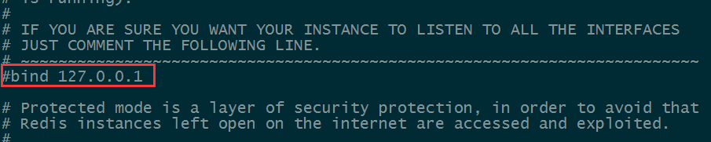

# 安装 Redis

环境:VMare+CentOS6

## 安装编译依赖

`yum install gcc-c++`

## 下载Redis安装包

[官网下载](https://redis.io/) [中文官网](http://www.redis.cn/) 上传到服务器 或者 wget获取

得到一个tar.gz文件

解压到指定目录

`tar -zxvf 文件名 目录`

## 安装Redis

首先编译文件将.c文件编译为.o文件

进入解压后的文件夹

编译 执行`make`

编译成功如下图

编译完成后安装

执行`make PREFIX=指定文件夹 install`

安装完后的bin目录

## 配置文件

安装完后先不急启动,在解压的目录下有个redis.conf文件

这是Redis的配置文件 肥肠重要 可以配置端口,绑定ip等

将它移动到redis安装目录下

`mv redis.conf 安装目录`

编辑redis.conf

`vi redis.conf`

* 配置后台运行Redis
  * 将`daemonize no`设置为`daemonize yes`
    * 
* 配置对外开放
  * 注释掉bind
    * 
  * `protected-mode yes`改为no
    * 

## 运行Redis

进入安装目录

执行`./bin/redis-server ./redis.conf`启动服务端

执行`ps -ef | grep redis`查看运行情况

至此安装完成

关闭
`./bin/redis-cli shutdown`
`kill -9 pid(ps -ef | grep redis查询可得)` 强制关闭可能丢失数据

## 运行客户端

添加key-value
查询key
退出

