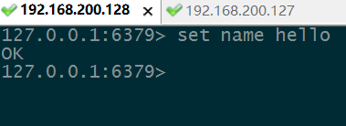

# Redis集群

## Redis主从关系配置

需要两台服务器(也可以同一台服务器启动两个Redis服务,配置两个不同端口,伪主从关系)

启动**主Redis**服务

配置**从Redis**的Redis.conf文件

开启replicaof(老一点的版本为slaveof)

配置内容为**主Redis**的ip以及端口号


*ps:记得清理**从Redis**上的持久化文件/dump.rdb与/bin/dump.rdb*

启动从Redis服务

在**主Redis**上添加key,可以看到**从Redis**上也进行了同步




## Redis集群搭建

上面的主从关系配置只是一个小小的热身 下面进行Redis的集群搭建

### Redis集群架构图


* 集群架构要点
  * 所有redis节点(node)**彼此互联**(ping-pong机制),内部使用二进制协议优化传输速度与带宽
  * 节点fail,集群中**超过半数**连接失败
  * 客户端不需要连接所有节点,只需要**连接其中一个**
  * redis-cluster将数据映射到槽上**slot(0-16383)**,通过hash得到key的槽
  * 16384个槽平均分配到节点上,存入key-value时,使用crc16算法计算key,对16384取余,**根据余数找到存入的节点**.

### redis-cluster投票容错

* **半数及以上master**与其中一个master连接失败则认为该master失效(fail)
* 什么时候认为集群整体不可用?
  * 挂掉的master**没有slave时**(也可认为slot映射不完整时)
  * **超过半数master失效**,不管是否有slave

### 搭建Ruby环境

编辑redis.conf开启cluster-enabled yes开启集群支持

可在解压的redis安装文件的src目录找到

安装Ruby

`yum ruby`

`yum rubygems`

如果安装版本太低后面执行文件会报语法错误,需要安装高本版,2.4.5

```Linux
 64 [root@localhost bin]# yum remove -y ruby
 65 [root@localhost bin]# yum remove -y rubygems
 66 [root@localhost bin]# cd /datas/soft/
 67 [root@localhost soft]# ll ruby-2.4.5.tar.gz     // ruby最新版
 68 -rwxr-xr-x   1 root root 14232887 Oct 24 19:33 ruby-2.4.5.tar.gz
 69 [root@localhost soft]# tar -xzf ruby-2.4.5.tar.gz
 70 [root@localhost soft]# cd ruby-2.4.5
 71 [root@localhost ruby-2.4.5]# ./configure
 72 [root@localhost ruby-2.4.5]# make
 73 [root@localhost ruby-2.4.5]# make install
 74 [root@localhost ruby-2.4.5]# ruby -v
```

*安装后的问题:输入ruby -v提示/usr/bin/ruby: No such file or directory*
*解决方案:输入ln -s /usr/local/bin/ruby /usr/bin/ruby,gem同理*

## 搭建集群

将redis-3.0.0.gem放入Linux并执行`gem install redis-3.0.0.gem` 所有服务器都要配置

开启所有服务器的redis,注意清空持久化文件`./bin/redis-server ./redis.conf`

在一台服务器上执行redis-trib.rb(redis安装包解压后src目录里`/home/apps/redis/redis-5.0.0/src`)


```
[root@chenxin01 bin]# ./redis-trib.rb create --replicas 1 192.168.200.127:6379 192.168.200.126:6379 192.168.200.125:6379 192.168.200.124:6379 192.168.200.123:6379 192.168.200.122:6379

WARNING: redis-trib.rb is not longer available!
You should use redis-cli instead.

All commands and features belonging to redis-trib.rb have been moved
to redis-cli.
In order to use them you should call redis-cli with the --cluster
option followed by the subcommand name, arguments and options.

Use the following syntax:
redis-cli --cluster SUBCOMMAND [ARGUMENTS] [OPTIONS]

Example:
redis-cli --cluster create 127.0.0.1:30001 127.0.0.1:30002 127.0.0.1:30003 127.0.0.1:30004 127.0.0.1:30005 127.0.0.1:30006 --cluster-replicas 1

To get help about all subcommands, type:
redis-cli --cluster help
```

提示需要使用`redis-cli`替代,跟换语句后正常执行

```
[root@chenxin01 bin]# ./redis-cli --cluster create 192.168.200.127:6379 192.168.200.126:6379 192.168.200.125:6379 192.168.200.124:6379 192.168.200.123:6379 192.168.200.122:6379 --cluster-replicas 1
```

```
>>> Performing hash slots allocation on 6 nodes...
Master[0] -> Slots 0 - 5460
Master[1] -> Slots 5461 - 10922
Master[2] -> Slots 10923 - 16383
Adding replica 192.168.200.124:6379 to 192.168.200.127:6379
Adding replica 192.168.200.123:6379 to 192.168.200.126:6379
Adding replica 192.168.200.122:6379 to 192.168.200.125:6379
M: 7856ea7e0c632e9f2315b895812cc3386548f179 192.168.200.127:6379
   slots:[0-5460] (5461 slots) master
M: a93d84ba79fe6d18ab3b2bdf72d641111b788a56 192.168.200.126:6379
   slots:[5461-10922] (5462 slots) master
M: fea1267f70b58e468f0dfc95e136248f79295cac 192.168.200.125:6379
   slots:[10923-16383] (5461 slots) master
S: bcdd7cc3b43bfffabc30bc0f1c20ce3184b17bb8 192.168.200.124:6379
   replicates 7856ea7e0c632e9f2315b895812cc3386548f179
S: ca84a73cc5d9313ff531934f59b63978bd0b2ae7 192.168.200.123:6379
   replicates a93d84ba79fe6d18ab3b2bdf72d641111b788a56
S: 159378ce026357ffe37d25eba3490ecd7bd79400 192.168.200.122:6379
   replicates fea1267f70b58e468f0dfc95e136248f79295cac
Can I set the above configuration? (type 'yes' to accept): yes
>>> Nodes configuration updated
>>> Assign a different config epoch to each node
>>> Sending CLUSTER MEET messages to join the cluster
Waiting for the cluster to join
....
>>> Performing Cluster Check (using node 192.168.200.127:6379)
M: 7856ea7e0c632e9f2315b895812cc3386548f179 192.168.200.127:6379
   slots:[0-5460] (5461 slots) master
   1 additional replica(s)
S: 159378ce026357ffe37d25eba3490ecd7bd79400 192.168.200.122:6379
   slots: (0 slots) slave
   replicates fea1267f70b58e468f0dfc95e136248f79295cac
M: a93d84ba79fe6d18ab3b2bdf72d641111b788a56 192.168.200.126:6379
   slots:[5461-10922] (5462 slots) master
   1 additional replica(s)
S: bcdd7cc3b43bfffabc30bc0f1c20ce3184b17bb8 192.168.200.124:6379
   slots: (0 slots) slave
   replicates 7856ea7e0c632e9f2315b895812cc3386548f179
S: ca84a73cc5d9313ff531934f59b63978bd0b2ae7 192.168.200.123:6379
   slots: (0 slots) slave
   replicates a93d84ba79fe6d18ab3b2bdf72d641111b788a56
M: fea1267f70b58e468f0dfc95e136248f79295cac 192.168.200.125:6379
   slots:[10923-16383] (5461 slots) master
   1 additional replica(s)
[OK] All nodes agree about slots configuration.
>>> Check for open slots...
>>> Check slots coverage...
[OK] All 16384 slots covered.
```

## 连接集群

`./bin/redis-cli -h ip -p port -c`

-c 表示连接集群

* cluster info
* cluster nodes

```
[root@chenxin04 redisinstall]# ./bin/redis-cli -c //连接集群
127.0.0.1:6379> cluster info //查看集群信息
cluster_state:ok
cluster_slots_assigned:16384
cluster_slots_ok:16384
cluster_slots_pfail:0
cluster_slots_fail:0
cluster_known_nodes:6 //节点数,包括从属节点
cluster_size:3
cluster_current_epoch:6
cluster_my_epoch:1
cluster_stats_messages_ping_sent:1877
cluster_stats_messages_pong_sent:1881
cluster_stats_messages_meet_sent:4
cluster_stats_messages_sent:3762
cluster_stats_messages_ping_received:1880
cluster_stats_messages_pong_received:1881
cluster_stats_messages_meet_received:1
cluster_stats_messages_received:3762
------------------------------------------------------
127.0.0.1:6379> get name //计算出的slot为其他节点的 从其他节点获取值
-> Redirected to slot [5798] located at 192.168.200.126:6379
"chenxin"
192.168.200.126:6379> get age //当然 人人都想停在18岁
-> Redirected to slot [741] located at 192.168.200.127:6379
"18"
```
