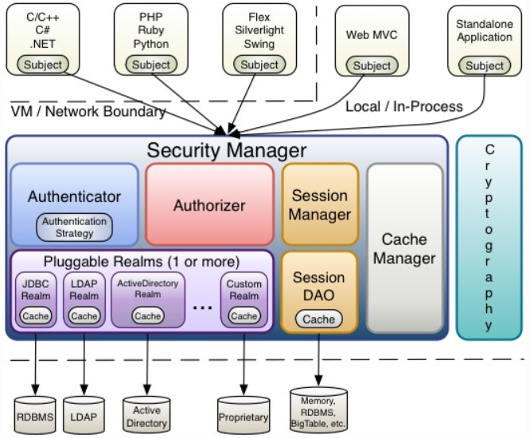

# Shiro入门

## 简介

安全管理框架

主要功能:认证,授权,加密,会话管理,web集成,缓存,集群分布式部署

基本功能


* Authentication:用户身份认证,登陆
* Authorization:授权
* SessionManageMent:会话管理
* Cryptography:加密
* Caching:缓存
* Concurrency:并发

*ps:Shiro不会去维护用户、维护权限；这些需要我们自己去设计/提供；然后通过相应的接口注入给Shiro即可*

## 架构

### 外部架构


>Subject：主体，代表了当前“**用户**”，这个用户不一定是一个具体的人，与当前应用交互的任何东西都是Subject，如网络爬虫，机器人等；即一个抽象概念；所有Subject都绑定到SecurityManager，与Subject的所有交互都会委托给SecurityManager；可以把Subject认为是一个门面；**SecurityManager才是实际的执行者**；
>SecurityManager：安全管理器；即所有与安全有关的操作都会与SecurityManager交互；且它**管理着所有Subject**；可以看出它是Shiro的核心，它负责**与后边介绍的其他组件进行交互**，如果学习过SpringMVC，你可以把它看成DispatcherServlet前端控制器；

>Realm：域，Shiro从从Realm**获取安全数据**（如用户、角色、权限），就是说SecurityManager要验证用户身份，那么它需要从Realm获取相应的用户进行比较以确定用户身份是否合法；也需要从Realm得到用户相应的角色/权限进行验证用户是否能进行操作；可以把Realm看成DataSource，即**安全数据源**。

>也就是说对于我们而言，最简单的一个Shiro应用：
1、应用代码通过Subject来进行认证和授权，而Subject又委托给SecurityManager；
2、我们需要给Shiro的SecurityManager注入Realm，从而让SecurityManager能得到合法的用户及其权限进行判断。

>从以上也可以看出，**Shiro不提供维护用户/权限**，而是通过Realm让开发人员自己注入。

### 内部



>* **Subject**：主体，可以看到主体可以是任何可以与应用交互的“用户”；
* **SecurityManager**：相当于SpringMVC中的DispatcherServlet或者Struts2中的FilterDispatcher；是Shiro的心脏；所有具体的交互都通过SecurityManager进行控制；它管理着所有Subject、且负责进行认证和授权、及会话、缓存的管理。
* **Authenticator**：认证器，负责主体认证的，这是一个扩展点，如果用户觉得Shiro默认的不好，可以自定义实现；其需要认证策略（Authentication Strategy），即什么情况下算用户认证通过了；
* **Authrizer**：授权器，或者访问控制器，用来决定主体是否有权限进行相应的操作；即控制着用户能访问应用中的哪些功能；
* **Realm**：可以有1个或多个Realm，可以认为是安全实体数据源，即用于获取安全实体的；可以是JDBC实现，也可以是LDAP实现，或者内存实现等等；由用户提供；注意：Shiro不知道你的用户/权限存储在哪及以何种格式存储；所以我们一般在应用中都需要实现自己的Realm；
* **SessionManager**：如果写过Servlet就应该知道Session的概念，Session呢需要有人去管理它的生命周期，这个组件就是SessionManager；而Shiro并不仅仅可以用在Web环境，也可以用在如普通的JavaSE环境、EJB等环境；所有呢，Shiro就抽象了一个自己的Session来管理主体与应用之间交互的数据；这样的话，比如我们在Web环境用，刚开始是一台Web服务器；接着又上了台EJB服务器；这时想把两台服务器的会话数据放到一个地方，这个时候就可以实现自己的分布式会话（如把数据放到Memcached服务器）；
* **SessionDAO**：DAO大家都用过，数据访问对象，用于会话的CRUD，比如我们想把Session保存到数据库，那么可以实现自己的SessionDAO，通过如JDBC写到数据库；比如想把Session放到Memcached中，可以实现自己的Memcached SessionDAO；另外SessionDAO中可以使用Cache进行缓存，以提高性能；
* **CacheManager**：缓存控制器，来管理如用户、角色、权限等的缓存的；因为这些数据基本上很少去改变，放到缓存中后可以提高访问的性能
* **Cryptography**：密码模块，Shiro提高了一些常见的加密组件用于如密码加密/解密的。

## shiro认证

### 环境准备

```xml
<dependencies>
		<dependency>
			<groupId>org.apache.shiro</groupId>
			<artifactId>shiro-core</artifactId>
			<version>1.2.3</version>
		</dependency>
		<dependency>
			<groupId>org.apache.shiro</groupId>
			<artifactId>shiro-web</artifactId>
			<version>1.2.3</version>
		</dependency>
		<dependency>
			<groupId>org.apache.shiro</groupId>
			<artifactId>shiro-spring</artifactId>
			<version>1.2.3</version>
		</dependency>
		<dependency>
			<groupId>org.apache.shiro</groupId>
			<artifactId>shiro-ehcache</artifactId>
			<version>1.2.3</version>
		</dependency>
		<dependency>
			<groupId>org.apache.shiro</groupId>
			<artifactId>shiro-quartz</artifactId>
			<version>1.2.3</version>
		</dependency>
		<dependency>
			<groupId>commons-logging</groupId>
			<artifactId>commons-logging</artifactId>
			<version>1.1.3</version>
		</dependency>
		<!-- 单元测试 -->
		<dependency>
			<groupId>junit</groupId>
			<artifactId>junit</artifactId>
			<version>4.12</version>
			<scope>test</scope>
		</dependency>
		<dependency>
			<groupId>org.slf4j</groupId>
			<artifactId>slf4j-log4j12</artifactId>
			<version>1.7.2</version>
			<scope>test</scope>
		</dependency>
		<dependency>
			<groupId>org.slf4j</groupId>
			<artifactId>slf4j-api</artifactId>
			<version>1.7.2</version>
		</dependency>
	</dependencies>
```

也可以直接导入shiro全部包

```xml
<dependency>
	<groupId>org.apache.shiro</groupId>
	<artifactId>shiro-all</artifactId>
	<version>1.2.3</version>
</dependency>
```
